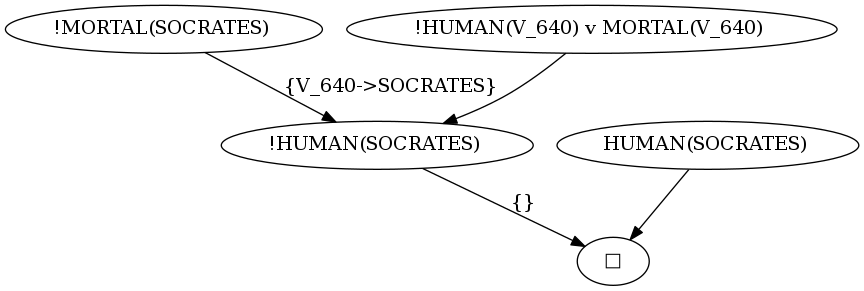

# Clover

[](https://travis-ci.org/moratori/clover)

一階述語論理式(閉論理式)の充足不可能性を判定するツールです。  
判定には導出原理(Resolution Principle)を使用しています。  
充足不可能性を判定できた場合は、導出反駁木(Refutation Tree)を示すGraphvizのコードを出力することが可能です  



## Usage

```
$ ./roswell/clover.ros
Command help
    :help                   show this help
    :quit                   quit from REPL
    :show-axiom             enumerate the axiomatic system that are currently defined
    :def-axiom    <name>    define an axiomatic system <name>
    :set-axiom    <name>    set current axiomatic system to <name>
    :show-strategy          show the current strategy for resolution
    :set-strategy <algorithm> <depth> set specific resolution algorithm
    :save-tree    <path>    save Graphviz code express refutation tree to <path>
(NIL)>>> :def-axiom human
input . to finish definition
axiom[1]>>> !human(x) | mortal(x)
axiom[2]>>> human(SOCRATES)
axiom[3]>>> .
(NIL)>>> :set-axiom human
(human)>>> mortal(SOCRATES)
PROVABLE under the human

(human)>>>
```

## Installation

### Roswellを使用する場合

```
$ cd ~/.roswell/local-projects/
$ git clone https://github.com/moratori/clover.git
$ ./clover/run-all-tests.sh
```

## Author

* moratori

## Copyright

Copyright (c) 2018 moratori

